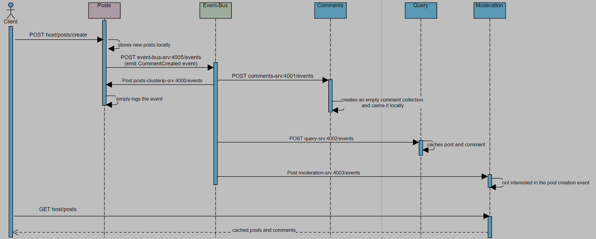
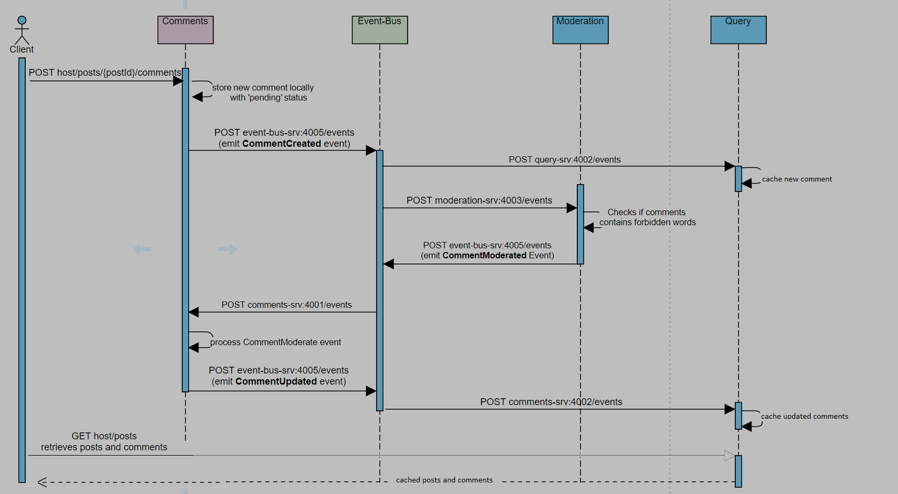
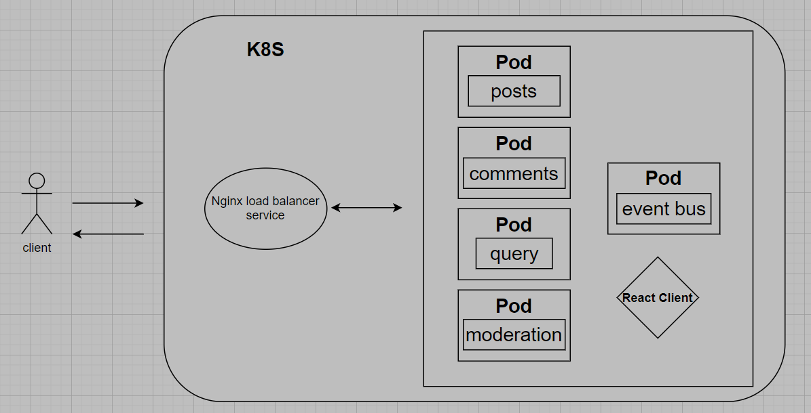

# Posts

A simple web app to demonstrate event-driven microservice architecture.

Users can create new posts and comments. By doing so, events will be created and sent to the event-bus microservice which will then emit the events to any services that are interested.

The app contains the following microservices:

    * posts service - for post creation

    * comments service - for comment creation

    * query service - for retrieving posts and comments from the in-memory db/cache

    * event-bus - receives events from services, and emits them to the subscribers

    * moderation service - look into the content of the comments and check if the contents contains any forbidden words. For demo only, this app prohibites the word 'orange' in any comments.

# Technologies

- Docker - Each microservice is run on Docker.

- Kubernetes - orchestrates Docker containers

- Skaffold - automates the development workflow

# Sequence Diagram

## Creates a post

## Comments on a post

# Software Architecture

# How to run

1. To run the app, ensure you have skaffold installed locally
   https://skaffold.dev/docs/install/
2. run `kubectl rollout restart deployment`
3. run `skaffold dev`
